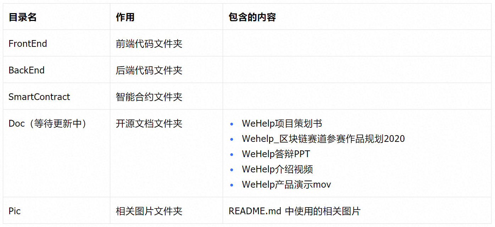
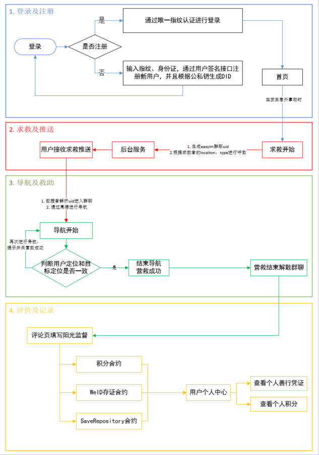
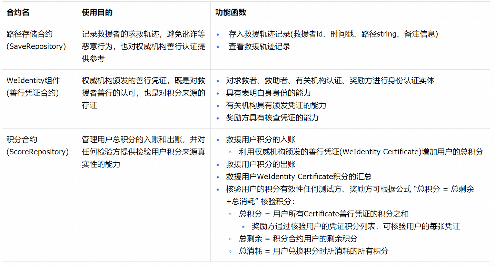
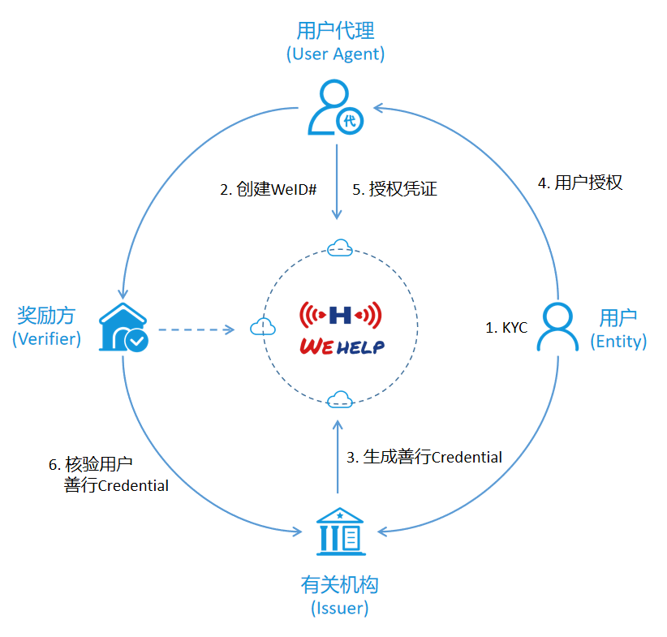
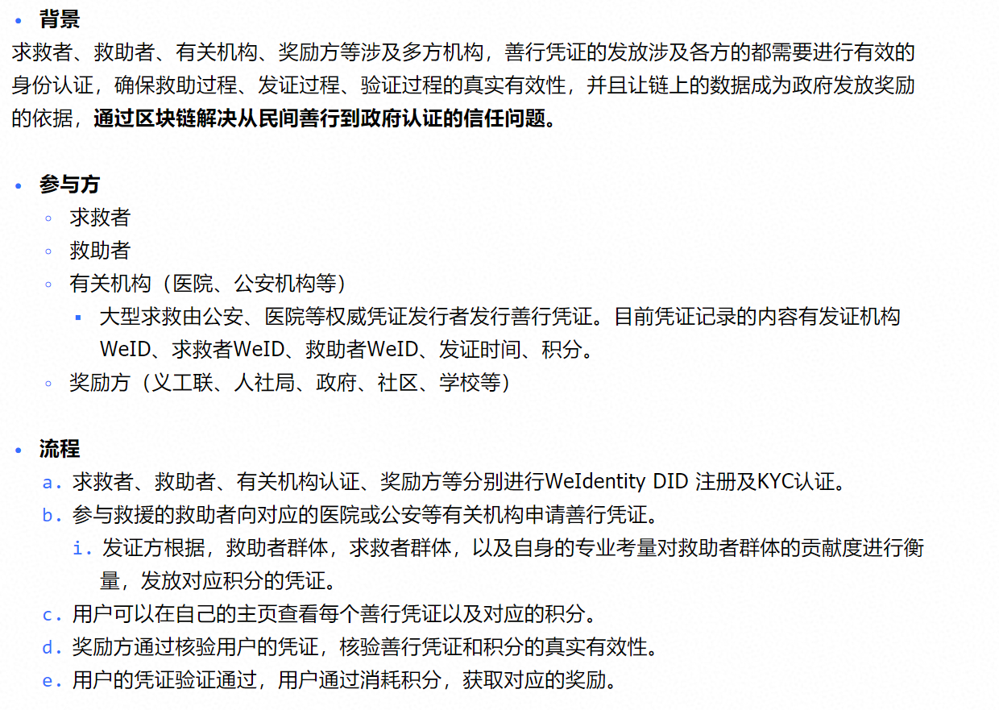
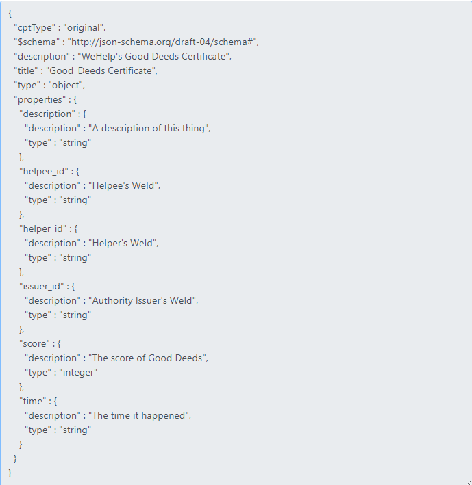

WeHelp采用可共享的分布式账本记录善行，避免数据被伪造，保证数据的公信力，让链上的数据成为政府发放奖励的依据，**通过区块链解决从民间善行到政府认证的信任问题**。

为众人抱薪者，不可使其冻毙于风雪，我们希望WeHelp不仅仅是一个APP产品，更是一种科技扬善的精神。

项目代码地址：

源码1（持续迭代中）：https://github.com/DarionRichie/wehelp-app

源码2（持续迭代中）：https://github.com/sunyd1006/wehelp-app

------

**Github 图片加载较慢，WeHelp 和您一起等待 **

------

# 目录说明

## 系统使用流程

# 合约设计和功能说明

## WeIdentity组件使用

### 使用思路图

### 使用说明

### 凭证CPT设计图

# 代码贡献

- 如果这个项目您觉的还不错，不妨点个赞呀
- 欢迎联系 `Keep Water` 团队参与后续迭代，我们非常需要您的建议和共享

# License

All contributions are made under the [GNU General Public License v3](https://www.gnu.org/licenses/gpl-3.0.en.html). See [LICENSE](https://github.com/FISCO-BCOS/FISCO-BCOS/blob/master/LICENSE).